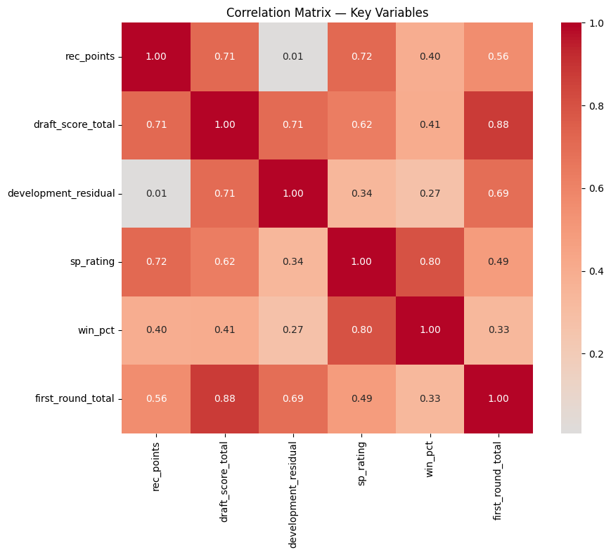

# Data Sources

## Source 1: CollegeFootballData.com API
The primary data source for this project comes from the [CollegeFootballData](https://collegefootballdata.com/exporter) API. This API aggregates college football statistics from multiple providers. 

The following endpoints were queried for years 2005-2023:

| Endpoint | Description | Years Available |
|----------|-------------|-----------------|
| `recruiting` | Recruiting class rankings and composite points by program | 2000–2023 |
| `sp ratings` | SP+ ratings, rankings, and sub-ratings by program | 2005–2023 |
| `records` | Win/loss records by program, includes classification | 2000–2023 |
| `coaches` | Head coach records and SP+ ratings by season | 2005–2023 |

All endpoints return JSON arrays that were converted to pandas DataFrames and concatenated across years. 

```{python}
#| code-fold: true
#| code-summary: "Data collection code"
#| eval: false

os.makedirs("data", exist_ok=True)
api_key = "YOUR_API_KEY_HERE"
headers = {"Authorization": f"Bearer {api_key}"}
url = "https://api.collegefootballdata.com/recruiting/teams"

def pull_yearly(url, start=2005, end=2024, label=""):
    dfs = []
    for year in range(start, end):
        r = requests.get(url, headers=headers, params={"year": year})
        data = r.json()
        if isinstance(data, list) and len(data) > 0:
            dfs.append(pd.DataFrame(data))
        else:
            print(f"  No data for year {year}")
        time.sleep(0.2)
    result = pd.concat(dfs, ignore_index=True)
    print(f"{label}: {result.shape}")
    return result

# recruiting data
print("Pulling recruiting...")
recruiting_df = pull_yearly(
    "https://api.collegefootballdata.com/recruiting/teams",
    label="Recruiting"
)
recruiting_df.to_csv("data/recruiting.csv", index=False)

# SP+ ratings data
print("Pulling SP+ ratings...")
sp_df = pull_yearly(
    "https://api.collegefootballdata.com/ratings/sp",
    label="SP+"
)
sp_df.to_csv("data/sp_ratings.csv", index=False)

# win/loss records data
print("Pulling records...")
records_df = pull_yearly(
    "https://api.collegefootballdata.com/records",
    label="Records"
)
records_df.to_csv("data/records.csv", index=False)

# coaches data
print("Pulling coaches...")
coaches_df = pull_yearly(
    "https://api.collegefootballdata.com/coaches",
    label="Coaches"
)
coaches_df.to_csv("data/coaches.csv", index=False)

print("\nAll done — files saved to data/")
```

The records endpoint returns nested JSON dictionaries for win/loss fields which required parsing. The coaches endpoint is a list of season objects per coach that required exploding into one row per coach-school-season. 

## Source 2: NFL Draft Dataset (Kaggle)

The second data source is an NFL draft prospects dataset sourced from ESPN via [Kaggle](https://www.kaggle.com/datasets/jacklichtenstein/espn-nfl-draft-prospect-data). The `nfl_draft_prospects.csv` file was used, and it contains information including:

| Field | Description |
|-------|-------------|
| `player_name` | Player full name |
| `school` | College program |
| `position` | Player position |
| `round` | Draft round (1-7) |
| `overall` | Overall pick number |
| `draft_year` | Year of NFL draft |

The dataset covers draft years 2010-2021. 

## Coverage

After cleaning and merging the two datasets, the final dataset that I used covers:

| Dimension | Coverage |
|-----------|----------|
| FBS Programs | 168 |
| Years (recruiting) | 2005–2016 (complete window) |
| Years (draft) | 2010–2021 |
| Total observations | 1,868 program-season records |
| Coach-school tenures | 2,493 parsed records |

# Data Cleaning and Preprocessing 

## School Name Standardization

When attempting to merge the two datasets, there was a lack of school name standardization across the two datasets. There were over 80 school name mismatches. In order to fix this, I manually mapped the names of 85+ entries. The mismatches fell into 2 categories:

- FBS name Variations (Florida Intl vs FIU)
- FCS/D2/D3 schools 

I dropped all non FBS schools for the purpose of focusing only on division 1 college football. 

```{python}
#| code-fold: true
#| code-summary: "School Name Standardization"
#| eval: false

# load cleaned data
recruiting = pd.read_csv("data/recruiting_clean.csv")
draft = pd.read_csv("data/nfl_draft_prospects.csv")

# Filter draft to 2005+ and actual drafted players
draft = draft[(draft["draft_year"] >= 2005) & (draft["round"].notna())].copy()

# Get unique school names from each
cfbd_teams = set(recruiting["team"].dropna().str.strip().unique())
draft_schools = set(draft["school"].dropna().str.strip().unique())

# Find mismatches
only_in_draft = sorted(draft_schools - cfbd_teams)
only_in_cfbd = sorted(cfbd_teams - draft_schools)
in_both = sorted(draft_schools & cfbd_teams)

print(f"Schools in both: {len(in_both)}")
print(f"Schools only in draft (need mapping): {len(only_in_draft)}")
print(f"Schools only in CFBD (no draft picks or name diff): {len(only_in_cfbd)}")
print()
print("=== DRAFT SCHOOLS NOT IN CFBD ===")
for s in only_in_draft:
    print(f"  '{s}'")
print()
print("=== CFBD SCHOOLS NOT IN DRAFT ===")
for s in only_in_cfbd:
    print(f"  '{s}'")

# Schools in draft that need mapping to CFBD names
# drop no fbs teams
draft_to_cfbd = {
    # fbs name fixes
    "Appalachian State":        "App State",
    "Connecticut":              "UConn",
    "Florida Intl":             "FIU",
    "Louisiana Monroe":         "UL Monroe",
    "San Jose State":           "San José State",
    "Southern Mississippi":     "Southern Miss",
    "Stephen F Austin":         "Stephen F. Austin",
    "UMass":                    "Massachusetts",
    "UT San Antonio":           "UTSA",
    "Tennessee-Martin":         "UT Martin",
    "Sam Houston State":        "Sam Houston",
    "North Carolina State":     "NC State",
    "Miami (FL)":               "Miami",
    "McNeese State":            "McNeese",
    "Nicholls State":           "Nicholls",
    "Prairie View":             "Prairie View A&M",
    "Presbyterian College":     "Presbyterian",
    "Southeastern Louisiana":   "SE Louisiana",

    # non fbs
    "Abilene Christian":        None,
    "Albany":                   None,
    "Albany State (GA)":        None,
    "Albion":                   None,
    "Ashland":                  None,
    "Australia":                None,
    "Bentley":                  None,
    "Bethel (TN)":              None,
    "Bloomsburg":               None,
    "California (PA)":          None,
    "Central Missouri":         None,
    "Central Missouri State":   None,
    "Chadron State":            None,
    "Charleston (WV)":          None,
    "Colorado State-Pueblo":    None,
    "Concordia-St. Paul":       None,
    "East Central":             None,
    "Ferris State":             None,
    "Fort Hays State":          None,
    "Grambling State":          None,
    "Grand Valley State":       None,
    "Harding":                  None,
    "Hillsdale":                None,
    "Hobart":                   None,
    "Hofstra":                  None,
    "Humboldt State":           None,
    "Indiana (PA)":             None,
    "Kutztown":                 None,
    "Lane":                     None,
    "Lenoir-Rhyne":             None,
    "Lindenwood":               None,
    "Manitoba":                 None,
    "Mars Hill":                None,
    "McGill":                   None,
    "Michigan Tech":            None,
    "Midwestern State":         None,
    "Missouri Southern State":  None,
    "Missouri Western":         None,
    "Morehouse":                None,
    "Mount Union":              None,
    "Nebraska-Omaha":           None,
    "Newberry":                 None,
    "North Alabama":            None,
    "Northeastern State":       None,
    "Northwest Missouri State": None,
    "Pittsburg State":          None,
    "Saginaw Valley":           None,
    "Sioux Falls":              None,
    "St. Augustine's":          None,
    "St. John's (MN)":          None,
    "St. Paul's College":       None,
    "Stillman":                 None,
    "Tarleton State":           None,
    "Tuskegee":                 None,
    "UW-Whitewater":            None,
    "Valdosta State":           None,
    "Virginia State":           None,
    "Washburn":                 None,
    "West Alabama":             None,
    "West Georgia":             None,
    "West Texas A&M":           None,
    "Western Ontario":          None,
    "Western Oregon":           None,
    "Wheaton College (Ill)":    None,
    "Whitworth":                None,
    "William Penn":             None,
    "Wingate":                  None,
    "Winston-Salem":            None,
    "Wisconsin-Whitewater":     None,
}

# apply mapping to draft data
draft["school_std"] = draft["school"].map(
    lambda x: draft_to_cfbd.get(x, x) if x in draft_to_cfbd else x
)

# drop rows where mapping is None (FCS/D2/international)
draft_fbs = draft[draft["school_std"].notna()].copy()

# verify overlap
cfbd_teams = set(recruiting["team"].dropna().str.strip().unique())
draft_schools_std = set(draft_fbs["school_std"].dropna().str.strip().unique())

still_missing = sorted(draft_schools_std - cfbd_teams)
matched = sorted(draft_schools_std & cfbd_teams)

print(f"Matched schools: {len(matched)}")
print(f"Still unmatched after mapping: {len(still_missing)}")
if still_missing:
    print("\nStill unmatched:")
    for s in still_missing:
        print(f"  '{s}'")

print(f"\nDraft picks remaining after FCS drop: {draft_fbs.shape[0]}")
print(f"Draft picks dropped (FCS/D2): {draft.shape[0] - draft_fbs.shape[0]}")

# fix the 1 remaining mismatch
draft_to_cfbd["Florida Intl"] = "Florida International"  # update existing entry

# Re-apply mapping
draft["school_std"] = draft["school"].map(
    lambda x: draft_to_cfbd.get(x, x) if x in draft_to_cfbd else x
)

# drop None mappings
draft_fbs = draft[draft["school_std"].notna()].copy()

# verify
cfbd_teams = set(recruiting["team"].dropna().str.strip().unique())
draft_schools_std = set(draft_fbs["school_std"].dropna().str.strip().unique())

still_missing = sorted(draft_schools_std - cfbd_teams)
matched = sorted(draft_schools_std & cfbd_teams)

print(f"Matched schools: {len(matched)}")
print(f"Still unmatched: {len(still_missing)}")
print(f"Draft picks remaining: {draft_fbs.shape[0]}")
```

## Complete Window Filtering

In order to run my analysis on NFL draft and development residuals (will discuss those more later), I had address the window in time between a player being recruited from high school and being drafted to the NFL. The NFL has a rule where a player must spend at least 3 years of college to be eligible for the NFL Draft. So, at the earliest, a player could be drafted 3 years after leaving high school. On the other end of the spectrum, typically the longest a player can be eligible for college football is 5 years (redshirt one year and play for 4 years). Because of this, players are drafted 3-5 years after leaving high school. For example, players from the high school recruiting class of 2010 would be drafted in the 2013, 2014, and 2015 NFL Drafts. Because of this lag in time, I had to ensure that each recruiting class had the right window. My data had recruiting class information through 2023, but it only had NFL draft data through 2021. Using the 3-5 year high school recruit to NFL draft pick window, the last year of high school recruiting data that I could use was 2016 because I needed information from the 2019-2021 NFL Drafts. Any high school recruiting class after 2016 would be missing NFL draft data. Because of this, I dropped all recruiting classes after 2016. 
After applying this filter, 1831 of the original observations had complete windows. These observations covered 2005-2016 recruiting classes and will form the core analytical dataset used throughout this project.

# Analytical Methodology

## Weighted Draft Scores

In order to assign numerical values to NFL draft picks to use in my analysis, I assigned weights to each round of the NFL draft. The weights were as follows:

- 1st Round Pick = 7 points
- 2nd Round Pick = 5 points
- 3rd Round Pick = 4 points
- 4th Round Pick = 3 points
- 5th Round Pick = 2 points
- 6th Round Pick = 1 points
- 7th Round Pick = 1 point

For each college team, all NFL draft picked were summed to produce a total weighted draft score for that program-year.

This methodology follows ideas from [Pro Football Reference's Draft Pick Trade Value](https://www.pro-football-reference.com/draft/draft_trade_value.htm). In this, they assign values for every pick of the NFL draft. As the round increases, the value of the pick decreases. In order to simplify for analysis, I assigned each pick within a round the same weight. This would allow the metric to be more interpretable and avoid overfitting to specific pick positions within rounds.

```{python}
#| code-fold: true
#| code-summary: "Draft Weight Calculator"
#| eval: false

draft = pd.read_csv("data/draft_clean.csv")

# round weight
round_weights = {1: 7, 2: 5, 3: 4, 4: 3, 5: 2, 6: 1, 7: 1}

draft["round"] = draft["round"].astype(int)
draft["weight"] = draft["round"].map(round_weights)

# collapse to school year level
draft_scored = (
    draft
    .groupby(["draft_year", "school_std"])
    .agg(
        total_picks=("player_name", "count"),
        weighted_draft_score=("weight", "sum"),
        first_round_picks=("round", lambda x: (x == 1).sum()),
        second_round_picks=("round", lambda x: (x == 2).sum()),
    )
    .reset_index()
    .rename(columns={"draft_year": "year", "school_std": "team"})
)

# add zero rows for schools with no draft picks that year, every FBS school should appear every year even with 0 picks
all_years = range(draft["draft_year"].min(), draft["draft_year"].max() + 1)
all_teams = draft["school_std"].unique()

full_index = pd.MultiIndex.from_product(
    [all_years, all_teams], names=["year", "team"]
)
draft_scored = (
    draft_scored
    .set_index(["year", "team"])
    .reindex(full_index, fill_value=0)
    .reset_index()
)
```

## Lag Structure

As discussed earlier, the recruits from the 2010 high school class would not be drafted until 2013-2015. In order to capture accurate draft scores for a high school recruiting class, I created a lagged draft score for each high school recruiting class at time T with the sum of NFL Draft Scores from time T+3, T+4, and T+5. 

```{python}
#| code-fold: true
#| code-summary: "Lag Structure"
#| eval: false

recruiting = pd.read_csv("data/recruiting_clean.csv")
draft_scored = pd.read_csv("data/draft_scored.csv")

lag_rows = []

for _, rec_row in recruiting.iterrows():
    rec_year = rec_row["year"]
    team = rec_row["team"]
    
    # +3 to +5 year window
    draft_window = draft_scored[
        (draft_scored["team"] == team) &
        (draft_scored["year"] >= rec_year + 3) &
        (draft_scored["year"] <= rec_year + 5)
    ]
    
    lag_rows.append({
        "year": rec_year,
        "team": team,
        "rec_rank": rec_row["rank"],
        "rec_points": rec_row["points"],
        "draft_picks_total": draft_window["total_picks"].sum(),
        "draft_score_total": draft_window["weighted_draft_score"].sum(),
        "first_round_total": draft_window["first_round_picks"].sum(),
        "draft_years_covered": len(draft_window),
    })

lagged_df = pd.DataFrame(lag_rows)

# complete window = all 3 draft years present (+3, +4, +5) (this will eliminate tail ends of the data)
lagged_df["complete_window"] = lagged_df["draft_years_covered"] == 3

```

## Development Residual

In order to understand how well coaches develop their athletes, and that development's impact on success, I created a development residual. A team with the #1 overall recruiting class should have higher draft scores in the following years than a team with the #50 recruiting class. However, this isn't always the case. To create the development residual, I fit a simple linear regression:

- draft_score_total ~ rec_points

This indicates the expected draft score of a specific team's recruiting class. The R^2 of the regression = .506, meaning that recruiting explains about 50% of draft production. The other 50% of the story is what I was trying to measure.

To construct the development residual, I used the following equation

- development residual = actual draft score - expected score given recruiting points

A positive residual means that the program produced more NFL talent than expected. A negative residual means that the program wasted the talent. 

```{python}
#| code-fold: true
#| code-summary: "Development Residual"
#| eval: false

from sklearn.linear_model import LinearRegression
import numpy as np

# complete windows only
complete = lagged_df[lagged_df["complete_window"] == True].copy()

# fit regression: draft_score ~ rec_points
X = complete[["rec_points"]].values
y = complete["draft_score_total"].values

model = LinearRegression()
model.fit(X, y)

# residuals = actual draft score - expected draft score given recruiting
complete["expected_draft_score"] = model.predict(X)
complete["development_residual"] = complete["draft_score_total"] - complete["expected_draft_score"]

print(f"R² of recruiting = draft score: {model.score(X, y):.3f}")
```

I then checked the correlation between development residual and rec_points, and found that the correlation was near zero (r=.01) This confirmed that the residual is independent from recruiting, and it's measuring something genuinely separate.



| Validation Check | Result |
|-----------------|--------|
| R² (recruiting → draft score) | 0.506 |
| Correlation (residual vs rec_points) | 0.01 |
| Interpretation | Residual is independent of recruiting |

## Clustering Analysis

After constructing the development residual, I attempted to identify natural groupings of programs based on three dimensions:

- Average recruiting points
- Average development residual
- Average win percentage

The goal was to identify any program archetypes. 

In order to do this, I tested KMeans, GMM, and DBSCAN clustering models.

```{python}
#| code-fold: true
#| code-summary: "Clustering"
#| eval: false

# aggregate to program level
program_level = (complete.groupby("team")
                 .agg(
                     avg_rec_points=("rec_points", "mean"),
                     avg_dev_residual=("development_residual", "mean"),
                     avg_win_pct=("win_pct", "mean"),
                     seasons=("year", "count")
                 )
                 .query("seasons >= 5")
                 .reset_index())

print(f"Programs with 5+ seasons: {program_level.shape[0]}")
print(program_level.describe().round(2))

# scale features
features = ["avg_rec_points", "avg_dev_residual", "avg_win_pct"]
X = program_level[features].dropna()
programs_clean = program_level.loc[X.index].copy()

scaler = StandardScaler()
X_scaled = scaler.fit_transform(X)

# test k=2 through k=8
print("\n=== silhoutte scores ===")
for k in range(2, 9):
    km = KMeans(n_clusters=k, random_state=42, n_init=10)
    labels = km.fit_predict(X_scaled)
    sil = silhouette_score(X_scaled, labels)
    inertia = km.inertia_
    print(f"  k={k}: silhouette={sil:.3f}, inertia={inertia:.1f}")


print("GMM silhoutte scores")
for n in range(2, 9):
    gmm = GaussianMixture(n_components=n, random_state=42, n_init=10)
    labels = gmm.fit_predict(X_scaled)
    sil = silhouette_score(X_scaled, labels)
    bic = gmm.bic(X_scaled)
    aic = gmm.aic(X_scaled)
    print(f"  n={n}: silhouette={sil:.3f}, BIC={bic:.1f}, AIC={aic:.1f}")

print("dbscan parameter search")


for eps in [0.3, 0.4, 0.5, 0.6, 0.7, 0.8, 1.0, 1.2]:
    for min_samples in [3, 4, 5]:
        db = DBSCAN(eps=eps, min_samples=min_samples)
        labels = db.fit_predict(X_scaled)
        
        n_clusters = len(set(labels)) - (1 if -1 in labels else 0)
        n_noise = (labels == -1).sum()
        
        # Only compute silhouette if more than 1 cluster and not all noise
        if n_clusters > 1 and n_noise < len(labels) - 1:
            sil = silhouette_score(X_scaled, labels)
            print(f"{eps:>6} {min_samples:>12} {n_clusters:>12} {n_noise:>10} {sil:>12.3f}")
        else:
            print(f"{eps:>6} {min_samples:>12} {n_clusters:>12} {n_noise:>10} {'N/A':>12}")
```

### Results

#### K-Means

| k | Silhouette Score | Inertia |
|---|-----------------|---------|
| 2 | 0.436 | 211.4 |
| 3 | 0.379 | 148.4 |
| 4 | 0.316 | 114.4 |
| 5 | 0.351 | 89.1 |
| 6 | 0.349 | 73.1 |
| 7 | 0.355 | 62.0 |
| 8 | 0.320 | 55.3 |

#### GMM

| n | Silhouette | BIC | AIC |
|---|-----------|-----|-----|
| 2 | 0.277 | 1049.4 | 996.6 |
| 3 | 0.093 | 1033.2 | 952.6 |
| 4 | 0.074 | 1057.2 | 948.9 |
| 5 | 0.056 | 1056.3 | 920.1 |

#### DBSCAN
Tested eps from 0.3 to 1.2, and the best result was 2 clusters with a silhouette = 0.387

### Conclusion

All three algorithms consistently produced poor cluster separations beyond k=2 or n=2. The best silhouette score across all methods was 0.436 at k=2 for K Means. Splitting programs into elite and non-elite was not analytically meaningful for the goals of this project.

From these poor clustering attempts, it's clear that college football programs do not fall into discrete archetypes. This finding informed the visualization approach as all visualizations use continuous scales to correctly address the fact that programs live on a continuous spectrum across recruiting, development, and winning dimensions.

# Limitations

Some of the key limitations for this project were:

Draft Data Ending in 2021: With draft data only going through 2021, I miss potential further analysis after 2016. College Football made changes to their transfer portal in 2018 which made it easier for athletes to transfer between colleges. Because I could not use data past 2016, I miss this window and potential to explore how the transfer portal changes impacted development on winning.

Causal Identification: The lag correlations show association between development and future winning. However, there could be confounding variables such as program resources, facilities, or geographic recruiting advantages that drive both development quality and future winning. Further explorations into this topic should attempt to find more data around these potential factors.