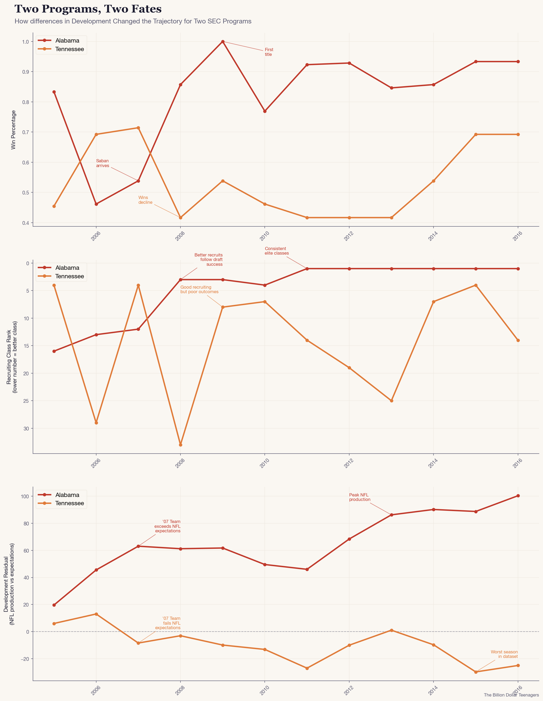

# The Fundamental Misunderstanding of College Football

## The World of College Recruiting and How Did We Get Here

Every year, college football programs invest millions of dollars into recruiting high school athletes. Between talent showcases, scouting, and official visits, these programs have been paying millions in order to convince a 17 year old to commit to their school. With the addition of NIL, the investment has increased dramatically as programs are now paying athletes directly to sign to their school. Schools are in a bidding war against each other to sign an athlete, and some of the winning bids reach as high as $10 million. Spread that amongst the 20-30 recruits that each teams sign every year, and the investment is astronomical. From an outsider's perspective, it's worth asking what drives these schools to spend so much on high schoolers. 

The willingness of these programs to pay up to $10 million comes from conventional thinking surrounding recruiting and winning in college athletics. The framework which has dominated college football for generations is that if you recruit the best athletes, then you are going to have an advantage on gameday so you will win more games. In theory, this idea makes sense. If you recruit the best 17 year olds in the country, then once they turn 22 they will be the best 22 year olds in the country, and you will have an advantage over every other team who is fielding worse players. This idea has been supported over the years as dynasties such as, Alabama in the 2010s, typically have a top 3 recruiting class every year. They continuously sign the best athletes in the country so they have a constant funnel of elite players. This thinking had gone unquestioned for decades. 

Then, in 2026 something happened that nobody expected. The University of Indiana won the 2026 College Football National Championship without a single 5 star recruits on their roster. Indiana failed to attract any of the top high school athletes to their team, yet they were able to win in spite of that. Was it sheer luck that brought Indiana a national championship? Or, did they uncover something fundamental about what actually drives winning? The data has an asnwer, and it might surprise you.

## A First Look

 I tracked recruiting rankings, win percentages, head coaching tenures, and draft outcomes across 168 FBS Schools from 2005 to 2016 to see if it could help answer these questions.


The scatterplot above explores the relationship between recruiting and winning across 2005 to 2016, using averages of a team's win percentage and recruiting points over the 11 year span. It corroborates conventional thinking, as programs that recruit better tend to also win more games (r=.61). Alabama stands out in the top right corner as the blueprint for what it means to be successful. One of the highest win percentages and the best recruiter in college football over the period. However, the relationship isn't as strong as conventional wisdom would say. Teams like Boise State act as stark outliers. They don't recruit well, but they win at an elite level. On the other hand, Tennessee and Kansas are both strong recruiters who have failed to win with those recruits. The variance across the plot is large enough to raise questions. Teams can have the same recruiting level but completely different win percentages. Recruiting points you in the right direction, but it's not the full story. Overall, this plot agrees with the idea that recruiting and winning typically have a positive relationship. However, is it because teans recruit better athletes and win because of it, or do teams win and then recruit better athletes after the fact, or are there hidden mechanisms working to prop this relationship up?

## The Plot Twist

To dig deeper into the relationship of recruiting and winning, what signing recruits today actually does for your team in the future. When a recruit first gets on campus, they typically aren't expected to become a starting player until 2 to 3 years later. This is for many factors. Older players are more physically developed, they understand the playbook better, and they've had more time to sharpen their skills. This is why you rarely see freshman playing. So the real question that we should be asking is how does a recruiting class affect the wins in the future. 

In addition to understanding how recruiting affects future wins, we must also explore other machanisms. The two additional mechanisms that I chose to explore were NFL Draft Results and Development Levels. To add a specific numerical value to NFL draft results for college teams, I assigned point values for each round of the draft that a player can be selected. A 1st round selection = 7 points (the best players are selected in the first round), 2nd round selection = 5 points, 3th round = 4... until the 7th round = 1 point. I add these up for each player that a specific team has selected in the draft for a given year, and that is the team's NFL Draft Score for that year. 

The second mechanism that I wanted to explore is the idea of development. Development is the idea of how much a player changed in skill level from their freshmen year to their senior year. In order to assign a numerical value to development, I measured the gap between how much NFL talent a program actually produced versus how much their recruiting rankings would predict. Programs that produce more NFL talent than expected have a positive development residual, meaning they're developing their players beyond their star rating. Programs that produce less than expected have a negative development residual. 

Combining all three of these ideas together, I chose to explore the relationship between recruiting, NFL Draft Results, and Development residuals on a team's wins in the next 3 years, and the results were surprising.

```{=html}
<iframe src="assets/lag_interactive.html" 
        width="100%" 
        height="600px" 
        frameborder="0"
        style="border: none; display: block;">
</iframe>
```

Draft Production and Development have far stronger associations with future wins than recruiting does. A team that produces NFL talen in 2010 and outperforms their expected draft results is more likely to win in 2012 and 2013. On the other hand, a strong recruiting class in 2010 tells you almost nothing about wins three years later. Recruiting's supposed positive association with wins was the result of the hidden mechanism of development. Once you account for how well a program develops players, recruiting rankings explain very little in terms of future wins. 

The idea that players being drafted in 2010 has a positive association with wins in 2013 sounds counterintuitive. Those players no longer play for the school in 2013 so how is the school winning? To understand this, we will explore Alabama and Tennessee, two SEC programs with very different trajectories over the period.


# A Case Study of Two SEC Programs

Alabama and Tennessee share a lot in common. They both play in the South Eastern Conference (SEC), both have historic programs known for winning, and both recruit some of the best high schoolers in the country. However, during the 2005-2016 period, Alabama built a dynasty while Tennessee went from a top tier program to mediocre. Using their trajectories, we can understand more about how development actually plays a role in future winning.



Looking at Alabama, upon Saban's arrival in 2007, the class he recruited exceeded NFL expectations. Players under his system went on to be drafted at a higher rate and in earlier rounds than their high school star rating would have predicted. After the development residual increases, wins increase in the following years. As wins increase, the recruiting rankings grow stronger. Meanwhile, Tennessee decreases their development residual below 0 in 2007, and this is followed by an immediate dip in their win percentage in 2008. Despite strong recruiting classes in the late 2000s, their development residual remains below 0 and as a result their win percentage stays low.

In both cases, development moved first. Wins and recruiting followed. This confirms the lag correlations from earlier. Development is the key to turning a program from a loser to a winner. 

These two teams tell the clearest story, but the patter holds across many programs. Use the explorer below to see how each team changes over time across all 3 metrics. Look at whether development, recruiting, or winning moved first.

```{=html}
<iframe src="assets/explorer.html" 
        width="140%" 
        height="600px" 
        frameborder="0"
        style="border: none; display: block;">
</iframe>
```

If development is the key to winning games in the future, what drives development differences across programs? Why does Alabama consistently develop players beyond expectations while Tennessee falls short? The answer: the Coach.

# Coaches Drive Development

Across 168 FBS programs from 2005 to 2016, the programs that consistently developed talent beyond their recruiting expectations aren't random. They cluster around specific coaches. The linked view below ranks coaches by their development residual to see where their program lands on the recruiting vs winning spectrum during their tenure.

Click the bars of the coaches with higher development residuals and notice where they fall on win percentage and recruiting compared to the coaches with lower development residual.

```{=html}
<iframe src="assets/linked_view.html" 
        width="140%" 
        height="600px" 
        frameborder="0"
        style="border: none; display: block;">
</iframe>
```

The coaches with the highest development residual typically had higher win percentages. This corroborates the findings earlier that development and winning are associated. The more interesting observation can be found through coaches that appear for multiple different schools. Chris Petersen appears twice in the scatterplot for his tenures at Boise State and the University of Washington. Despite far different recruiting rankings, he managed to win with both schools. Rich Rodriguez, on the other hand, coached at three schools and failed to win at two of them. The shocking part is that he recruited better at those schools than at the school he won with. 

College Football Programs chase after 17 year olds and invest in them thinking that they are going to turn their program around. However, the person who is going to turn their program around is the 40 year old coach sitting on the sidelines. Teams should focus more resources on investing in the best coaches who can build the pipelines of development, and the recruits and winning will follow. The billion dollar question isn't who you recruit; it's who you hire to develop them.

# The Verdict

The programs that consistently win in college football aren't the ones spending the most on recruiting. They're the ones who have cracked the code on developing players into NFL talent. Winning games and signing stronger recruits is a byproduct of that. The stars in a recruiting class don't win games, it's what the coach does with the stars that turns them into champions. Schools shouldn't invest all of their money to convince high schoolers to sign with their school. Instead, they should invest in the best coaching staff that they can afford. If you bring in the right coaches who can develop players into NFL-caliber athletes, then the wins will soon follow.

The next time you see two programs entering into an NIL bidding war for a 17 year old, ask the more important question: who's going to develop them?